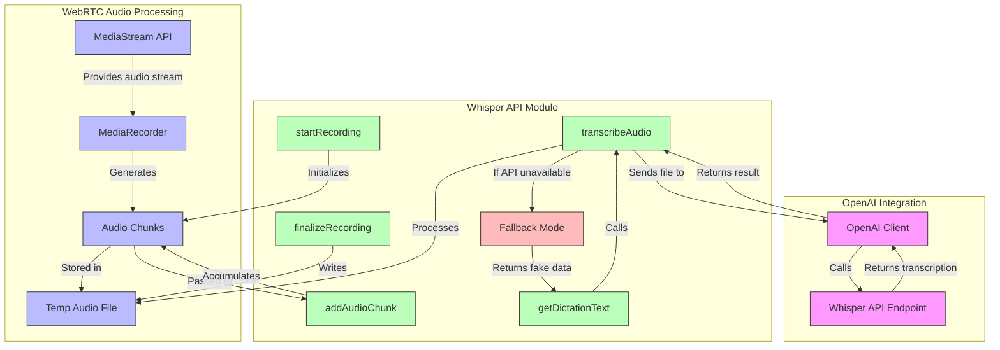

```mermaid
graph TB
    subgraph "WebRTC Audio Processing"
        MediaStream[MediaStream API]
        MediaRecorder[MediaRecorder]
        AudioChunks[Audio Chunks]
        AudioFile[Temp Audio File]
    end
    
    subgraph "Whisper API Module"
        StartRecording[startRecording]
        AddChunk[addAudioChunk]
        FinalizeRecording[finalizeRecording]
        Transcribe[transcribeAudio]
        GetText[getDictationText]
        FallbackMode[Fallback Mode]
    end
    
    subgraph "OpenAI Integration"
        WhisperEndpoint[Whisper API Endpoint]
        OpenAIClient[OpenAI Client]
    end
    
    MediaStream -->|Provides audio stream| MediaRecorder
    MediaRecorder -->|Generates| AudioChunks
    AudioChunks -->|Stored in| AudioFile
    
    StartRecording -->|Initializes| AudioChunks
    AudioChunks -->|Passed to| AddChunk
    AddChunk -->|Accumulates| AudioChunks
    FinalizeRecording -->|Writes| AudioFile
    
    GetText -->|Calls| Transcribe
    Transcribe -->|Processes| AudioFile
    Transcribe -->|If API unavailable| FallbackMode
    FallbackMode -->|Returns fake data| GetText
    
    Transcribe -->|Sends file to| OpenAIClient
    OpenAIClient -->|Calls| WhisperEndpoint
    WhisperEndpoint -->|Returns transcription| OpenAIClient
    OpenAIClient -->|Returns result| Transcribe
    
    style MediaStream fill:#bbf,stroke:#333,stroke-width:1px
    style MediaRecorder fill:#bbf,stroke:#333,stroke-width:1px
    style AudioChunks fill:#bbf,stroke:#333,stroke-width:1px
    style AudioFile fill:#bbf,stroke:#333,stroke-width:1px
    style StartRecording fill:#bfb,stroke:#333,stroke-width:1px
    style AddChunk fill:#bfb,stroke:#333,stroke-width:1px
    style FinalizeRecording fill:#bfb,stroke:#333,stroke-width:1px
    style Transcribe fill:#bfb,stroke:#333,stroke-width:1px
    style GetText fill:#bfb,stroke:#333,stroke-width:1px
    style FallbackMode fill:#fbb,stroke:#333,stroke-width:1px
    style WhisperEndpoint fill:#f9f,stroke:#333,stroke-width:1px
    style OpenAIClient fill:#f9f,stroke:#333,stroke-width:1px
```