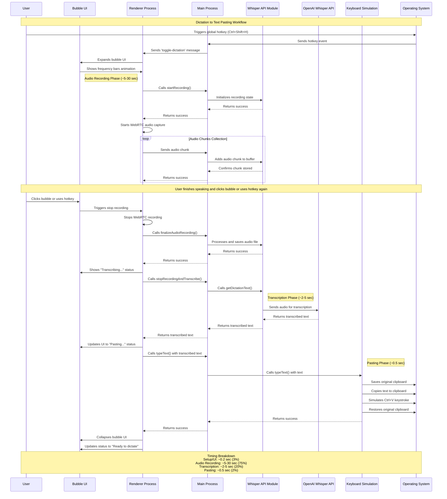

```mermaid
sequenceDiagram
    participant User
    participant UI as Bubble UI
    participant Renderer as Renderer Process
    participant Main as Main Process
    participant Whisper as Whisper API Module
    participant OpenAI as OpenAI Whisper API
    participant KBSim as Keyboard Simulation
    participant OS as Operating System

    Note over User,OS: Dictation to Text Pasting Workflow
    
    User->>OS: Triggers global hotkey (Ctrl+Shift+H)
    OS->>Main: Sends hotkey event
    Main->>Renderer: Sends 'toggle-dictation' message
    Renderer->>UI: Expands bubble UI
    UI->>Renderer: Shows frequency bars animation
    
    Note right of UI: Audio Recording Phase (~5-30 sec)
    Renderer->>Main: Calls startRecording()
    Main->>Whisper: Initializes recording state
    Whisper-->>Main: Returns success
    Main-->>Renderer: Returns success
    
    Renderer->>Renderer: Starts WebRTC audio capture
    
    loop Audio Chunks Collection
        Renderer->>Main: Sends audio chunk
        Main->>Whisper: Adds audio chunk to buffer
        Whisper-->>Main: Confirms chunk stored
        Main-->>Renderer: Returns success
    end
    
    Note over User,OS: User finishes speaking and clicks bubble or uses hotkey again
    
    User->>UI: Clicks bubble or uses hotkey
    UI->>Renderer: Triggers stop recording
    Renderer->>Renderer: Stops WebRTC recording
    Renderer->>Main: Calls finalizeAudioRecording()
    Main->>Whisper: Processes and saves audio file
    Whisper-->>Main: Returns success
    Main-->>Renderer: Returns success
    
    Renderer->>UI: Shows "Transcribing..." status
    Renderer->>Main: Calls stopRecordingAndTranscribe()
    Main->>Whisper: Calls getDictationText()
    
    Note right of Whisper: Transcription Phase (~2-5 sec)
    Whisper->>OpenAI: Sends audio for transcription
    OpenAI-->>Whisper: Returns transcribed text
    Whisper-->>Main: Returns transcribed text
    Main-->>Renderer: Returns transcribed text
    
    Renderer->>UI: Updates UI to "Pasting..." status
    Renderer->>Main: Calls typeText() with transcribed text
    
    Note right of KBSim: Pasting Phase (~0.5 sec)
    Main->>KBSim: Calls typeText() with text
    KBSim->>OS: Saves original clipboard
    KBSim->>OS: Copies text to clipboard
    KBSim->>OS: Simulates Ctrl+V keystroke
    KBSim->>OS: Restores original clipboard
    KBSim-->>Main: Returns success
    Main-->>Renderer: Returns success
    
    Renderer->>UI: Collapses bubble UI
    Renderer->>UI: Updates status to "Ready to dictate"
    
    Note over User,OS: Timing Breakdown<br/>Setup/UI: ~0.2 sec (3%)<br/>Audio Recording: ~5-30 sec (75%)<br/>Transcription: ~2-5 sec (20%)<br/>Pasting: ~0.5 sec (2%)
```